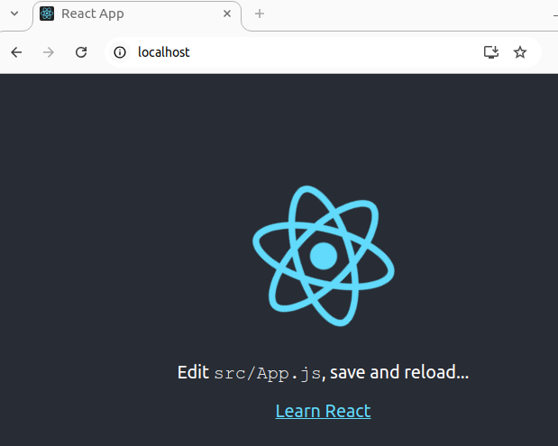

# Docker

## Project build statuses

### Tests

[](https://github.com/heathen1878/Docker/actions/workflows/frontend_test.yaml) [](https://github.com/heathen1878/Docker/actions/workflows/client_test.yaml)

### Builds

#### NodeJs Web App

[](https://github.com/heathen1878/Docker/actions/workflows/push_frontend_to_dh.yaml) 

#### Fibonacci Calculator

[](https://github.com/heathen1878/Docker/actions/workflows/push_api_to_dh.yaml) [](https://github.com/heathen1878/Docker/actions/workflows/push_client_to_dh.yaml) [](https://github.com/heathen1878/Docker/actions/workflows/push_nginx_to_dh.yaml) [](https://github.com/heathen1878/Docker/actions/workflows/push_nginx_to_dh.yaml)

#### Terraform Cli

[](https://github.com/heathen1878/Docker/actions/workflows/push_tfcli_to_dh.yaml) [](https://github.com/heathen1878/Docker/actions/workflows/push_tfcli_to_acr.yaml)

## Introduction

### What are containers?

Containers are isolated software environments that allow packages applications to run across different platforms regardless of the underlying infrastructure. Docker is one such platform that facilitates this.

Containers fix the challenges of deploying application across inconsistent environments, environments with resource constraints, and enables quicker deployments and scaling.

#### OCI

The Opem Container Initiative (OCI) has 3 main specs which define

- Runtime specs - container engine
- Image specs - image format
and...
- Distribution specs - standardised API to facilitate the distribution of content

### Evolution of virtualisation

#### Bare metal

Shared depedencies as binaries and libraries live on the same OS.

- Inefficient from a resource utilisation point-of-view
- slow start up and shutdown
- provisioning tedious

#### Virtual Machines

Shared hardware but OSes are independent.

- Better utilisation of resources
- faster start up and shutdowns
- faster provisioning and templating

#### Containers

Shared OS with container runtime; containers can run on either bare metal or virtual machines.

- Application and binaries are sharing the Linux kernel; Windows is different :thinking:
- Binaries and libraries are isolated to the container
- Start up and shutdowns in seconds
- Excellent resource utilisation

##### Platforms

- Docker
- Podman

##### Runtimes

- Containerd (k8s uses this)
- Cri-o

## Underlying technology

### Namespaces

Namespaces enable the isolation of systems resources e.g. the process namespace isolates processes so a container process cannot see host processes or processes in other containers.

There are networking, file system mount points, Naming, User and inter-process communication namespaces which allow containers to run isolated in Linux.

### Control Groups

To view cgroups...

```shell
cat /proc/cgroups
```

Limits amount of resources used per process...

:point_up: specific to Linux
Docker Desktop runs a Linux Virtual Machine...which is where the containers reside and it's that Linux Kernel that controls / isolates access.

#### Container process

A running process with access to a given set of resources

process within container -> kernel -> allocated hardware resources

### Union filesystems

Unifies several filesystems into one; Docker uses overlayfs. Directories with the same path are merged whereas files at the upper layer take precedence over the same files at the lower layer.

## Docker Engine

The Docker Engine is the open source components of Docker Desktop; specifically the client CLI, dockerd and Docker API.

## Docker Client

This component is __Part of the Docker Engine__.

```shell
docker --version
```

Passes commands to the Docker Server

### Extensions

...

## Docker Server / Host

This component is __Part of the Docker Engine__.

The installation of Docker Desktop creates a virtual machine locally that exposes the Docker API and runs dockerd.

### Windows

On a Windows System Docker Desktop can use WSL or Hyper-V as the virtual machine.

### Docker API

This component is __Part of the Docker Engine__.
...

### Docker Daemon - dockerd

Part of the Docker Engine.
...

## Docker Commands

### Docker Pull

Downloads an image from the registry...this command would be run by Docker Run too if the image doesn't exist locally.

```shell
docker pull image_name

#e.g.
docker pull busybox # pull the latest version of busybox
```

### Docker Build

Build a Docker image from a dockerfile; `-f` is useful if the dockerfile isn't called dockerfile e.g. `dockerfile.dev`.

```shell
docker build -f ./dockerfile -t name:tag .
```

pass in `--progress=plain` to enable a more verbose...

if for some reason you wanted to disable caching pass in `--no-cache`

### Docker Image

List the images available locally...

```shell
docker image ls
```

```text
$dom in ../Docker on  main [ 📝  🗃️  ×2 ] 
2s bash $ ➜ sudo docker image ls
REPOSITORY                     TAG       IMAGE ID       CREATED         SIZE
heathen1878/basic              latest    755bfc9736da   2 hours ago     7.8MB
basic                          latest    755bfc9736da   2 hours ago     7.8MB
```

#### Remove

```shell
docker image rm basic
```

```shell
docker image ls
```

```text
$dom in ../Docker on  main [ 📝  🗃️  ×2 ] 
2s bash $ ➜ sudo docker image ls
REPOSITORY                     TAG       IMAGE ID       CREATED         SIZE
heathen1878/basic              latest    755bfc9736da   2 hours ago     7.8MB
```

To remove multiple images you could use something like...

```shell
images=$(sudo docker image list --all --format json | jq -rc .ID)

for image in $images
do
   sudo docker image rm $image --force
done
```

### Docker Run

Docker run creates a container from the image and runs that container locally.

`docker run` pretty much equals `docker create` and `docker start`

:point_down:
Docker Server will check the image cache for cached copies of the requested image.

```text
Unable to find image 'hello-world:latest' locally
latest: Pulling from library/hello-world
c1ec31eb5944: Pull complete
...
Status: Downloaded newer image for hello-world:latest
```

then run the container...

```text
To generate this message, Docker took the following steps:
 1. The Docker client contacted the Docker daemon.
 2. The Docker daemon pulled the "hello-world" image from the Docker Hub.
    (amd64)
 3. The Docker daemon created a new container from that image which runs the
    executable that produces the output you are currently reading.
 4. The Docker daemon streamed that output to the Docker client, which sent it
    to your terminal.
```

#### Overriding the startup command

This is similar to overiding the entrypoint using `--entrypoint`.

```shell
docker run busybox ls
```

```text
$dom in ../Docker on  master [ 📝 ] 
3s bash $ ➜ sudo docker run busybox ls
bin
dev
etc
home
lib
lib64
proc
root
sys
tmp
usr
var
```

### Running detached

In the example below a web server is being run locally on port 80 in a detached state.

```shell
docker run -d -p 80:80 --name frontend frontend
```

```text
$dom in ../Docker on  main [ 📝  🗃️  ×2 ] 
39ms bash $ ✘ sudo docker run -d -p 80:80 --name frontend frontend
4f0a7ff2e2f04f7443034a3529dbf6c790c7e8e71640b24ef5f3a3da992ede15
```



### Init

The init flag can be used to ensure the init process runs as `PID 1`; therefore can control cleaning up zombie processes and handling signal forwarding. If you have coded for signal handling and are unlikely to have any zombie processes then `--init` isn't needed.

### Name

Used to assign a predefined name to a container; __NOTE__ containers must be unique on your computer.

### Network

Allows you to connect to a predefined Docker network; by default all containers share the same network.

### Platform

Useful to pull specific image platform architecture e.g. arm, amd64...

### Restart

USed to define the restart policy for a container; the options are no restart, restart on failure and optionally retry x no. of times, restart unless stopped or always restart.

```shell
docker run --restart always ubuntu

watch "docker container list"
```

### Advanced options

#### Capabilities

You can use `--cap-drop=all` and then `--cap-add=blah` to lock down the runtime security of the container.

#### CPU and CPU Shares

`--cpus` can limit the number of core allocated to a container and `--cpu-shares` can assign a relative share of CPU time to a container.

#### Memory and memory reservation

`--memory` can limit the memory allocated to a container; should it exceed that amount it will be restarted whereas memory reservation guarantee an amount of memory.

#### User

`--user` allow you to specify a non root user; by default the container will run as root. Ideally the dockerfile would specify the `USER` instruction to ensure that user is used to run the entrypoint and cmd. If the group is not specified then the user will be run with the root group.

#### Read only

`--read-only` this forces the container file system to be read only...

#### Security Options

[seccomp](seccomp)

[apparmour](apparmor)

#### User Namespace remapping

[here](userns-remap)

## Docker Container

### List

From the example above the running container is...

```shell
docker container ls
```

```text
dom in ../Docker on  main [ 📝 ] 
1s bash $ ➜ sudo docker container ls
CONTAINER ID   IMAGE      COMMAND                  CREATED         STATUS         PORTS                               NAMES
4f0a7ff2e2f0   frontend   "/docker-entrypoint.…"   8 minutes ago   Up 8 minutes   0.0.0.0:80->80/tcp, :::80->80/tcp   frontend
```

#### List all

```shell
docker container ls --all
```

#### Start

Docker start by default doesn't output STDOUT or STDERR. You can use `docker logs container id` to view the logs from a container

#### Stop

To stop a container you can run `docker stop container id` or `docker kill container id`.

Docker `stop` uses `SIGTERM` a.k.a. a graceful shutdown whereas docker kill uses `SIGKILL` a.k.a. stop now...

If the container doesn't stop after 10 seconds when docker stop was issued then docker will automatically issue docker kill. It can depend on whether the running process understands SIGTERM, if not a SIGKILL will be needed.

## Docker System

### Prune

```shell
docker system prune
```

:point_up: deletes stopped containers and cleans up build cache

## Docker Logs

```shell
docker logs container id
```

## Docker Exec

`docker exec -it container id sh | bash`

You can also use `-it` with docker run.

You can also connect to an existing running container using `docker attach containerid`; the limitation of this is, stdin is only connected to the primary process.

## Data persistence

By default any changes within the container are ephemeral; containers are stateless by nature. If data changes should persist then consider using volumes, bind mounts, or tmpfs mounts.

### Volumes

By default docker volumes are stored in `/var/lib/docker/volumes/`, you can modify the locatio used by Docker by editing `/lib/systemd/system/docker.service` and changing `ExecStart` to include `--data-root /something`

Volume mounts exist within the virtual machine running the container therefore allowing data to be persisted across container restarts.

```shell
# Create a volume
docker volume create docker_volume_name

docker run -v docker_volume_name:/path_within_the_container docker_image_name
```

:point_up: it more difficult to inspect the contents of a Docker Volume compared with a bind mount. There is a privileged container you can run to view the volumes. See [here](https://github.com/sidpalas/devops-directive-docker-course/tree/main/04-using-3rd-party-containers#i-volume-mounts)

### Bind Mounts

Bind mounts connect back to the host filesystem also persisting data across container restarts; this option may have a sllight performance overhead for heavy erad / writes.

Bind mounts tend to be used where software developers are making code changes and want those changes to be reflected automatically within the container without having to rebuild the container or where you want to pass a start-up configuration file to postgres, nginx or similar. See the projects section for examples of these.

```shell
docker run -v local_path:/container_path

# You can also bookmark a container path within a path reference e.g
docker run -v container_path/directory_within_container -v local_path:/container_path
```

:point_up: in the example above directory_within_container would not reference the local filesystem even though the root directory references the local filesystem.

__NOTE__
Docker Compose is useful when you need to pass many options to Docker.

### TmpFs Mounts

Tmpfs mounts are in-memory storage...

### Container Registries

#### Docker Hub

Default public registry, use docker login.

```shell
docker login
```

#### Azure Container Registry

Use az cli for Azure Container Registry

__NOTE:__ If you need to use `sudo` prefix all the commands below with `sudo`.

```shell
az login

# List out the container registries...and take the first one...
acr=$(az acr list | jq -rc .[0].name)

# Authenticate
az acr login --name $acr

# Tag for ACR
# Use docker build -f dockerfile -t crmanual.azurecr.io/terraform_wrapper/tfcli:latest or tag an existing image using...
docker tag heathen1878/tfcli $acr.azurecr.io/terraform_wrapper/tfcli:latest

# Push to the ACR
docker push acr_name.azurecr.io/repo/image:tag
```

See [here](.github/workflows/push_tfcli_to_acr.yaml) for GitHub Workflow for doing the above.

#### Webhooks

Webhooks are useful to notify other applications that an application or service image has been built or updated.

#### Tagging

Images should be tagged using semantic versioning but you'll see lots of different methods; most are descriptive see [here](https://hub.docker.com/_/alpine/tags) for examples.

#### Manual image

`docker run -it apline` :point_left: grab the ID of this container.

run the commands within the container...

`docker commit -c 'CMD [ "redis-server" ] container-id`

## Dockerfiles

The dockerfile is a text documentation that contains instructions that docker should execute; see [docker build](#docker-build). The `.` represents the build context i.e. where the source code resides.

Within the build context you can include a `.dockerignore` file which tells docker to ignore files, folders...

### Principles

- Pin specific versions
- base images
  - system dependencies
  - application dependencies
- small and secure :point_down:

Generally it is best to try and use the `alpine`, `slim`, `minimal`, or whichever variant defines small of the docker image; and a specific version too.

```dockerfile
FROM almalinux:8-minimal
```

or for language specific images...

```dockerfile
FROM node:lts-alpine
```

```dockerfile
FROM golang:alpine
```

- Protect the cache layer
  - order copy commands by frequency of change
  - use cache mounts
  - use COPY --link - creates a new layer not tied to the previous layer # Requires dockerfile version 1.5
  - combine steps that are always linked...using heredocs... :point_down:

  ```dockerfile
  RUN <<CMDS
  apt update
  apt upgrade -y
  apt install iputils-ping -y
  CMDS
  ```

- Set the working directory
- Set the expose port
- Define any environmental variables - can be used at build and runtime
- Define any build arguments - can only be used at build time

```dockerfile
WORKDIR /app
EXPOSE 8080
ENV variable=env_var
ARG variable=build_var
```

- Use `.dockerignore`

- Use a non root user
- Ensure only the required dependencies are installed...between dev and prod
- Use multi stage builds

```dockerfile
USER nonroot

FROM image:version as build-base
COPY --from=build-base /some/file /some/file
```

- Directives
  - version
  - escape characters
- Label
  - Add author details

```dockerfile
# syntax=docker/dockerfile:1.5
# escape=\

LABEL org.opencontainers.image.authors="dom@domain.com"
```

#### Security

Scan your images...

[docker snyk](https://docs.snyk.io/getting-started)

### Buildx

Buildx allows you to create images for multiple architectures from a single dockerfile.

## Projects

### Base Linux Images

This example [docker_build.yml](https://raw.githubusercontent.com/heathen1878/Docker/master/base_linux_image/docker_build.yml) file builds a Docker Image and deploys it to an Azure Container Registry tagged with the build ID. The template reference can be found [here](https://raw.githubusercontent.com/heathen1878/azdo_pipelines/main/docker_build/docker_build.yml)

### Azure DevOps Agent

This example is taken from [here](https://learn.microsoft.com/en-us/azure/devops/pipelines/agents/docker?view=azure-devops#linux) but uses the base Linux image above rather as a starting point. It does assume the repository name from the base Linux image is named azdodockerbase.

Example variable file

```yaml
variables:
  service_connection: '' # your ACR service connection name
  image_repository: 'azdoagent'
  container_registry: '' # your ACR url...azurecr.io
  dockerfile_path: $(Build.SourcesDirectory)/azdo_self_hosted_linux_agent/Dockerfile
  tags: '233'
```

### Databases

#### Postgresql

Postgresql can easily be deployed using a prebuilt official image; and easily customised using bind mounts and volumes.

```shell
docker volume create pgdata

docker build -f projects/postgresql/dockerfile projects/postgresql/ -t heathen1878/postgres:dom

docker run -d -v pgdata:/var/lib/postgresql/data -e POSTGRES_PASSWORD=p@ssw0rd -p 5432:5432 heathen1878/postgres:dom
```

Using Docker Compose...

```shell
# passing sudo -E to expose the postgres password to Docker Compose. The script create_environment_variables.sh can pull values from KV or GitHub and create environmental variables.

sudo -E docker compose --project-directory projects/postgresql/ up
```

#### Redis

...

### Interactive test environments

Useful for running code against runtime not installed locally.

### Command line utilities

The Terraform wrapper contains tooling to assist in running Terraform.

```shell
docker build -f projects/terraform_wrapper/dockerfile projects/terraform_wrapper --build-arg TERRAFORM_VERSION="1.9.3" -t heathen1878/tfcli:22.04 -t heathen1878/tfcli:latest

# Create a local alias which run the container mounting local source directories and .ssh directories into the container.
alias 'tfcli=sudo docker run --rm -it -v ~/source:/root/source -v ~/.ssh:/root/.ssh heathen1878/tfcli:latest bash'
```

```shell
# Run the contaner from the alias above
tfcli

# Test authentication using Az Cli
tfauth 

# Exit the container
exit
```

### Node Js

This is a simple Node Js web app running as a container; see instructions [here](./projects/node_js_web_app/readme.md)

### Multi tier app

This example uses docker compose to build the networking between in each container. The [dockerfile](./projects/multi_tier_app/dockerfile) defines how the image should be built and [docker compose](./projects/multi_tier_app/docker-compose.yml) builds it and run the container with any additional instructions. Instructions [here](./projects/multi_tier_app/readme.md)

### Fibonacci Calculator app

This example uses docker compose to build the networking between in each container. The project has several dockerfiles...

[API](./projects/fibonacci_calculator/api/dockerfile)

[Client](./projects/fibonacci_calculator/client/dockerfile)

[Proxy](./projects/fibonacci_calculator/nginx/dockerfile)

[Worker](./projects/fibonacci_calculator/worker/dockerfile)

which define how each container image should be built and [docker compose](./projects/fibonacci_calculator/docker-compose.yml) builds it and runs the containers with any additional instructions. The project depends on PostgreSQL and Redis; the docker compose file builds them from specified images hosted on Docker Hub. Instructions [here](./projects/fibonacci_calculator/readme.md)

In a cloud environment you may use managed instances of these. See these examples...

[Container Apps](https://github.com/heathen1878/ACA)

[Container Instances](https://github.com/heathen1878/ACI)

[Kubernetes](https://github.com/heathen1878/AKS)

### Node and Go API with React Frontend

...

## Useful links

[Willy Wonka](https://www.youtube.com/watch?v=GsLZz8cZCzc)

[Dockerfile teardown](./redis_server/teardown.md)

[Docker Example](./redis_server/dockerfile)